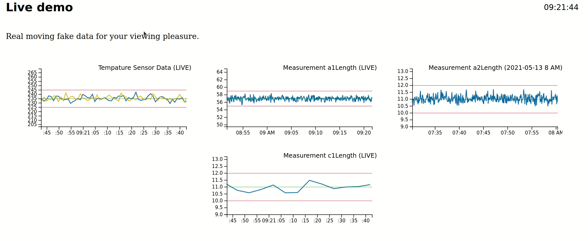

This is a simple demo of some data visualizations for randomly generated mock data.




Dev Notes
---------

Some common React/Typescript/ESNext features may be missing from the build chain. This is
because I've purposefully avoided blindly copying configurations for the purposes of code review.

Linting + proper typescript type checks, Scss and more are included (for the client), there's just simply quite a lot
that goes into a modern javascript build system.

Notably, the server forgoes all of that and uses plain old nodejs (though having a common typescript codebase to share between them
would be ideal, it's out of scope for this small project).

Running Instructions
--------------------

This demo has a backend and frontend server

To run, first start the backend (websocket) server by running
```
  cd server && npm start
```

In another terminal start the frontend application server by running
```
  cd client && npm start
```

Go to `localhost:8080` to observe the application.